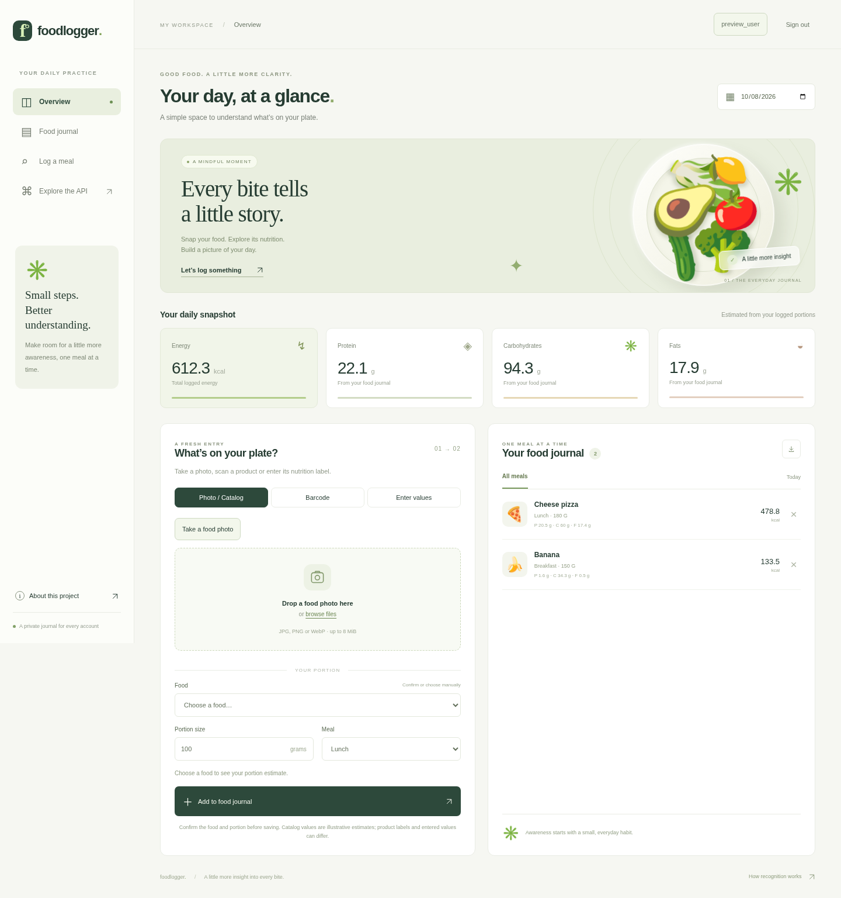

# FoodLogger

**A little more insight into every bite.**

A food-recognition and nutrition journal built with **Python, TensorFlow,
FastAPI and SQLite**. Create a private account, photograph food or a product
barcode, review its nutrition, and track the portions you eat. The responsive
website supports phone cameras, uploaded photos and manual nutrition entries.

[מדריך התחלה בעברית](docs/START_HERE_HE.md) · [Model card](docs/MODEL_CARD.md) ·
[Third-party resources](docs/THIRD_PARTY.md) · [Render deployment](docs/DEPLOYMENT.md)



## Features

- **Private accounts:** Argon2id password hashing, opaque HttpOnly sessions,
  CSRF protection and one-time recovery codes. Every journal operation is scoped
  to the signed-in account.
- **Barcode nutrition:** decode GTIN/EAN/UPC barcodes from camera photos or uploads,
  or enter the digits. Open Food Facts supplies available product nutrients.
  Review and correct values before saving; missing nutrients stay missing.
- **Nutrition labels:** enter custom products, choose grams or millilitres, and
  preserve calories, macros, sugars, saturated fat, fibre, salt, sodium and
  additional source data alongside each saved portion.
- **Real inference:** a cached MobileNetV2 checkpoint, 23 supported ImageNet food
  categories, top suggestions, and an explicit uncertain state.
- **Human confirmation:** manually correct the food and supply grams. A photo
  does not determine mass, ingredients or a recipe.
- **A complete journal:** add/delete meals, browse dates, view calorie and macro
  totals, and export a day's entries to CSV. Data persists in SQLite.
- **A clean backend:** typed validation, bounded image uploads, an OpenAPI API,
  dependency injection, and tests independent of model downloads.
- **A trainable pipeline:** stratified train/validation split, a separate test
  set, frozen-backbone transfer learning, fine-tuning, model checkpoints and
  reproducible model/label/metric exports.
- **A responsive UI:** no frontend build tool, external fonts, analytics or image
  API. Photos are decoded in memory and are not stored.

The pretrained classifier is an ImageNet baseline, **not a model trained on
Food-101 by this project**. The bundled nutrition values are illustrative,
rounded estimates; they are not a verified USDA data extract.

## Run locally

Use **Python 3.11 or 3.12**. Linux, Windows and Apple Silicon have TensorFlow 2.20
wheels; this project was exercised on Linux CPU. Intel macOS users can use the
Docker option or run the journal without the ML extra.

```bash
git clone https://github.com/ophbra22/food-_loger.git FoodLogger
cd FoodLogger
python3 -m venv .venv
source .venv/bin/activate
python -m pip install --upgrade pip
python -m pip install -e ".[ml,dev]"
foodlogger download-model
foodlogger
```

On Windows, use `python` instead of `python3` and activate with
`.venv\Scripts\Activate.ps1` in PowerShell.

Open **[http://127.0.0.1:8000](http://127.0.0.1:8000)**. Interactive API docs are at
[http://127.0.0.1:8000/docs](http://127.0.0.1:8000/docs).

The weights are about 14 MB and are cached under `~/.keras/models/`, with SHA-256
verification. The first inference loads TensorFlow and takes longer. A GPU and
API keys are not required. After installation and weight download, inference
works offline. `pip install -e ".[dev]"` runs the journal without TensorFlow;
photo recognition then returns an explicit setup message instead of fake results.

The default journal is `runtime/journal.sqlite3`, relative to your launch
directory. Launch from the same directory, or set `FOODLOGGER_DB` to an absolute
path. Register an account in the browser and save the recovery code shown once.
There is no email recovery. Accounts and journals share this database; keep a
consistent backup with SQLite's backup API. Older anonymous journal entries are
retained as unowned legacy data and are never assigned to newly registered users.

## Usage

1. Create an account, save your recovery code, and select a journal date.
2. Choose **Photo / Catalog**, **Barcode**, or **Enter values**.
3. For food photos, confirm the suggested food and its measured weight. For a
   product, photograph its barcode or enter its digits; review the label values
   per 100 g or 100 ml and set the amount you consumed. You can fill missing data
   manually if a product is absent or incomplete in Open Food Facts.
4. Add the confirmed portion. Your account's daily totals update immediately.
5. Browse dates, expand saved nutrition details, export CSV or delete entries.

The camera controls use the device's native photo picker/camera. Availability
varies by browser and device; file upload and barcode digits remain available.
The app decodes barcode **photos**, rather than continuously streaming video.

## Architecture

```text
Browser upload → size/format/pixel validation → RGB crop → TensorFlow
                                                         ↓
                                   original model scores + food candidates
                                                         ↓
                           user confirms food + measured weight in grams
                                                         ↓
                  per-100g catalog → nutrient estimate → SQLite snapshot
                                                         ↓
                                         daily summary / CSV export
```

```text
src/foodlogger/
  app.py           FastAPI factory and HTTP endpoints
  auth.py          password hashing, sessions and account recovery
  products.py      barcode decoding and Open Food Facts normalization
  security.py      deployment settings and bounded request rate limits
  classifier.py    lazy model loading, inference, probability postprocessing
  images.py        upload and image validation
  nutrition.py     catalog lookup and portion scaling
  schemas.py       request validation
  storage.py       parameterized SQLite journal with nutrient snapshots
  training.py      training, fine-tuning, test evaluation and export
  cli.py           local server and model download commands
  data/foods.json  inspectable illustrative nutrition catalog
  static/          responsive CSS and browser behavior
  templates/       application HTML
scripts/           Food-101 split conversion
tests/             domain, API, inference policy and dataset tests
```

| Endpoint | Purpose |
|---|---|
| `GET /api/health` | Server health; does not preload or claim model readiness |
| `GET /api/foods` | Foods and nutrition provenance |
| `POST /api/auth/register`, `/login`, `/recover` | Account access; requires `X-FoodLogger-Request: 1` |
| `GET /api/auth/me`, `POST /api/auth/logout` | Current account/CSRF token and session revocation |
| `GET /api/products/{barcode}` | Validated barcode lookup; account required |
| `POST /api/barcode/scan` | Decode a barcode photo; account and CSRF required |
| `POST /api/meals/custom` | Save reviewed product/manual nutrition and quantity |
| `POST /api/predict` | Multipart `file`; JPEG/PNG/WebP, up to 8 MiB and 20 MP |
| `GET /api/nutrition?food_id=banana&grams=150` | Portion estimate |
| `POST /api/meals` | Save confirmed food, grams, date and meal type |
| `GET /api/meals?day=2026-10-08` | Meals and consistent totals for one date |
| `DELETE /api/meals/{id}` | Remove a journal entry |
| `GET /api/export?day=2026-10-08` | Download one day as CSV |

All journal, prediction and product endpoints require the session cookie.
Mutating authenticated requests also require `X-CSRF-Token`, returned by the
account endpoints. The website handles both automatically. Cross-origin writes
are rejected; authentication responses and private API data use `Cache-Control:
no-store`. JSON body validation never echoes passwords.

## Deploy the Python website on Render

The repository includes a [Render Blueprint](render.yaml): one Python web service
in Frankfurt, a 2 GB compute plan, a 1 GB persistent disk, HTTPS session cookies,
server-side TensorFlow and a checkpoint downloaded and verified during build.
This configuration uses **paid resources**. Review the current Render charges
before creating them. A free ephemeral filesystem must not hold the account DB.

[Deploy this repository on Render](https://dashboard.render.com/select-repo?type=blueprint)

See [deployment and operations](docs/DEPLOYMENT.md) for the exact configuration,
backup procedure and live verification steps. This file is deployment
configuration; it does not by itself mean a public service has been created.

## Train your own classifier

Prepare separate `train/<class>` and `test/<class>` directories with at least two
classes. Each class needs at least two training photos and one test photo.
Images must be JPG, PNG or BMP. Class names become the ordered output labels.

```text
datasets/my-foods/
  train/pizza/*.jpg
  train/ice_cream/*.jpg
  test/pizza/*.jpg
  test/ice_cream/*.jpg
```

For [Food-101](https://data.vision.ee.ethz.ch/cvl/datasets_extra/food-101/), obtain
and extract the dataset separately under its terms. This helper preserves the
official train/test partition and copies only the selected classes:

```bash
python scripts/prepare_food101.py \
  --source datasets/food-101 \
  --destination datasets/food101-small \
  --classes pizza ice_cream hot_dog

foodlogger-train --data datasets/food101-small --output models/food101-small \
  --epochs 5 --fine-tune-epochs 3 --batch-size 32 --seed 42
```

Validation uses a seeded 20% holdout from each training class. The test set is
not used for checkpoint selection. Fine-tuning unfreezes the last 30 backbone
layers while keeping BatchNorm frozen, at a lower learning rate. The best
validation-loss checkpoint across both stages is exported and evaluated once
on test data. Start with a small class subset; training is substantially faster
on a suitable GPU. Results depend on your dataset, seed and hardware.

Outputs: `model.keras`, `best.keras`, ordered `labels.json`, `split_manifest.json`
and `metrics.json` (sample counts, seed, TF version, loss, top-1 and top-k metrics).
For fewer than four classes, top-k may be trivial; inspect top-1 accuracy and
class balance. Training refuses a nonempty output directory to preserve runs.
`--weights none` is for smoke tests, not a useful pretrained baseline.

Use your exported model:

```bash
export FOODLOGGER_MODEL="$PWD/models/food101-small/model.keras"
foodlogger
```

In PowerShell: `$env:FOODLOGGER_MODEL = "$PWD/models/food101-small/model.keras"`.
The adjacent `labels.json` is loaded automatically. Custom models accept
`float32` RGB pixels in `[0,255]`, input `(None,224,224,3)`, with preprocessing
embedded and one softmax value per label. Only load models you trust.

Labels must match IDs in `data/foods.json` for automatic nutrition matching.
Unknown labels are shown as unmapped and require manual selection; nutrition
is never invented. To extend coverage, add a reviewed nutrition record with the
exact class ID and its provenance. An `imagenet_index` is only needed for the
default classifier. Duplicate paths across splits are rejected; near-duplicate
or copied image contents still need dataset curation.

## Verification

```bash
pytest
ruff check src tests scripts
ruff format --check src tests scripts
python -m build
```

Run the optional TensorFlow training/export/reload test:

```bash
FOODLOGGER_RUN_ML_TESTS=1 pytest -m integration
```

PowerShell: set `$env:FOODLOGGER_RUN_ML_TESTS = "1"` before `pytest -m integration`.
The integration fixture contains synthetic noise and proves pipeline operation,
**not food-recognition accuracy**. GitHub Actions runs ordinary checks on Python
3.11 and 3.12; a manual workflow also runs the ML smoke test.

Optional browser tests cover registration, account isolation, barcode photo
decoding, product review, manual labels, save/upload locking, persistence, CSV
export, deletion and mobile overflow:

```bash
python -m pip install -e ".[browser]"
playwright install chromium
FOODLOGGER_RUN_BROWSER_TESTS=1 pytest -m browser
```

Set `FOODLOGGER_CHROMIUM` to an existing Chromium executable if needed.

## Docker

```bash
docker compose up --build
```

Open the same localhost URL. Compose persists the SQLite journal and model cache
in named volumes, and exposes the port on loopback only. Weight download happens
at first inference. The Docker/Compose configuration has not been independently
validated across supported platforms.

## Configuration

| Variable | Default / meaning |
|---|---|
| `FOODLOGGER_DB` | `runtime/journal.sqlite3`; absolute persistent path required in production |
| `FOODLOGGER_ENV` | `development`; set `production` behind HTTPS |
| `FOODLOGGER_PUBLIC_URL` | Public HTTPS origin; falls back to `RENDER_EXTERNAL_URL` |
| `FOODLOGGER_TRUSTED_PROXY_HOPS` | `0`; Render Blueprint uses `1` for its appended client IP |
| `PORT` | `8000`; Render supplies its service port |
| `FOODLOGGER_WEIGHTS` | Optional local MobileNetV2 ImageNet `.h5` checkpoint |
| `FOODLOGGER_MODEL` | Optional custom `.keras` model, takes priority over weights |
| `FOODLOGGER_LABELS` | Optional labels path; defaults next to custom model |
| `KERAS_HOME` | Keras cache directory; defaults to `~/.keras` |

If recognition is unavailable, run `foodlogger download-model`, verify the ML
extra was installed in the active virtual environment, and inspect server logs.
Manual logging continues to work. To change ports: `foodlogger --port 8001`.

## License

Code is MIT licensed; third-party models and datasets
retain their own terms. See [third-party notes](docs/THIRD_PARTY.md).
